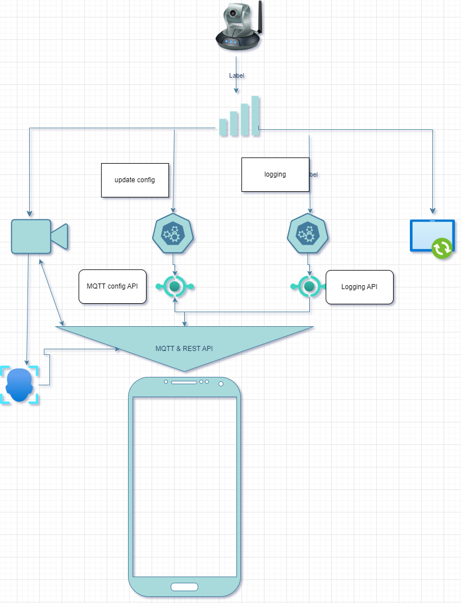

# Esp32 - Cam Application based on Mosquitto communication protocol

# To Upload and start the app, do:
> 1. Activate virtual env ```Adafruit/Scripts/Activate```
> 2. To upload the files:  ```python "C:\...\PycharmProjects\iot_projects_esp32_module\Wifi\upload_files_mpremote.py" COM3 "C:\....\PycharmProjects\iot_projects_esp32_module\camera\Mqtt"```
> 3. To Start the app: ```mpremote run D:\esp32\camera\Mqtt\main.py```

Azure Broker: "20.208.128.223" (Video can be accessed anywhere)
local Broker: "192.168.1.131" (Video can only be accessebly from same network)

# Configure local Broker

> 1. Modify C:\Program Files\mosquitto\mosquitto.conf(C:\Program Files\mosquitto) file by adding the correct local IP address
   
   
> 2. Windows services panel, search for mosquitto and start the service


# Flowchart
